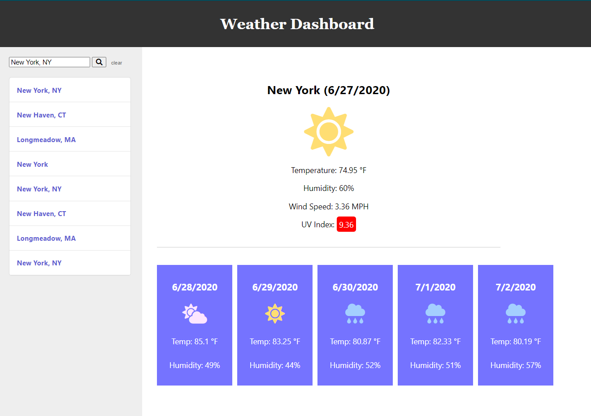

# weathercast-NJE

A fairly basic weather forecast app created using the OpenWeather API ((https://openweathermap.org/api)) for weather information (and ipapi.com for location details.) This was produced as a project for the UCONN Coding Bootcamp, and it is not intended for private or commercial use beyond that purpose. 

## Possible Errors

Please note that the app is designed only to provide info on locations in the US. It WILL attempt to provide info for foreign locations as provided by the API, but success and accuracy are not guaranteed. "Multiple-name" locations (i.e. Hong Kong) will definitely not function properly. 

## Original Guidelines

GIVEN a weather dashboard with form inputs
WHEN I search for a city
THEN I am presented with current and future conditions for that city and that city is added to the search history
WHEN I view current weather conditions for that city
THEN I am presented with the city name, the date, an icon representation of weather conditions, the temperature, the humidity, the wind speed, and the UV index
WHEN I view the UV index
THEN I am presented with a color that indicates whether the conditions are favorable, moderate, or severe
WHEN I view future weather conditions for that city
THEN I am presented with a 5-day forecast that displays the date, an icon representation of weather conditions, the temperature, and the humidity
WHEN I click on a city in the search history
THEN I am again presented with current and future conditions for that city
WHEN I open the weather dashboard
THEN I am presented with the last searched city forecast

## Link

https://njohnerwin.github.io/weathercast-NJE/

## Screenshot

